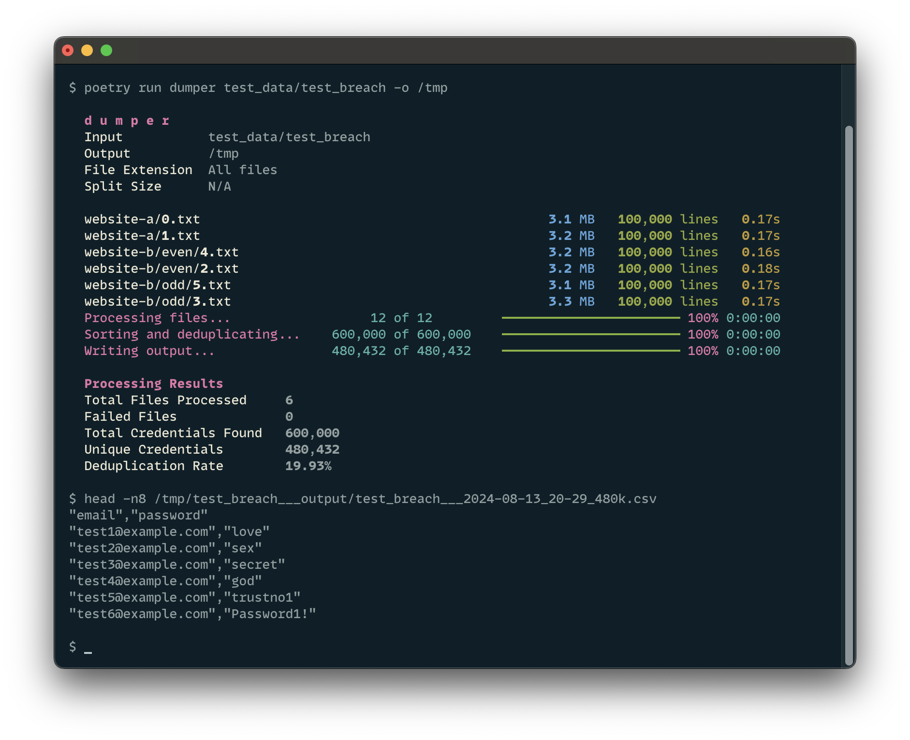

# dumper

A Python tool for parsing and extracting credentials from various file formats.

## Installation

This project uses Poetry for dependency management. To install the project and its dependencies:

1. Ensure you have Poetry installed. (https://python-poetry.org/docs/#installation)

2. Clone the repository:
   ```
   git clone https://github.com/jakub/dumper.git
   cd dumper
   ```

3. Install dependencies:
   ```
   poetry install
   ```

## Usage

To run the script, use the following poetry entrypoint:

```
poetry run dumper <input_path>
```


### Options

- `input_path`: Input directory - can be a relative or absolute path.
- `-o, --output`: (optional) Output directory - can be a relative or absolute path. If not specified, the output will be saved in the current working directory.
- `-e, --ext`: (optional) File extensions to process (default: all files)
- `-s, --split`: (optional) Split output into files with specified number of lines
- `-n, --no-ui`: (optional) Disable rich UI and log output to `<output_dir>/report.txt`


### Examples

1. **Process a dump directory, relative path:**

   Parses all files in `./Collection_1` and outputs to `./Collection_1___output`
   ```
   poetry run dumper Collection_1
   ```

2. **Process a dump directory, only .txt files**

   Parses all `.txt` files in `./Collection_1` and outputs to `./Collection_1___output`
   ```
   poetry run dumper Collection_1 -e txt
   ```

3. **Process a dump directory (absolute path), output to a specific directory:**

   Parses all files in `/tmp/breaches/Collection_1` and outputs to `/mnt/upload_queue/Collection_1___output`
   ```
   poetry run dumper /tmp/breaches/Collection_1 -o /mnt/upload_queue
   ```

4. **Process dump directory, only .txt files, and split output into files with 1000 lines each:**

   Parses all `.txt` files in `/tmp/breaches/Collection_1` and outputs to `/mnt/upload_queue/Collection_1___output`, split into files with 1000 lines each.
   ```
   poetry run dumper /tmp/breaches/Collection_1  -e txt -o /mnt/upload_queue -s 1000
   ```

5. **Process dump directory without the rich UI and output to report.txt:**

   Parses all files in `/tmp/breaches/Collection_1` without no stdout, instead logs activity to `/tmp/breaches/Collection_1___output/report.txt`
   ```
   poetry run dumper /tmp/breaches/Collection_1 --no-ui
   ```

You get the idea. No? Here's a picture.



## License

This project is licensed under the MIT License. Go hog wild.